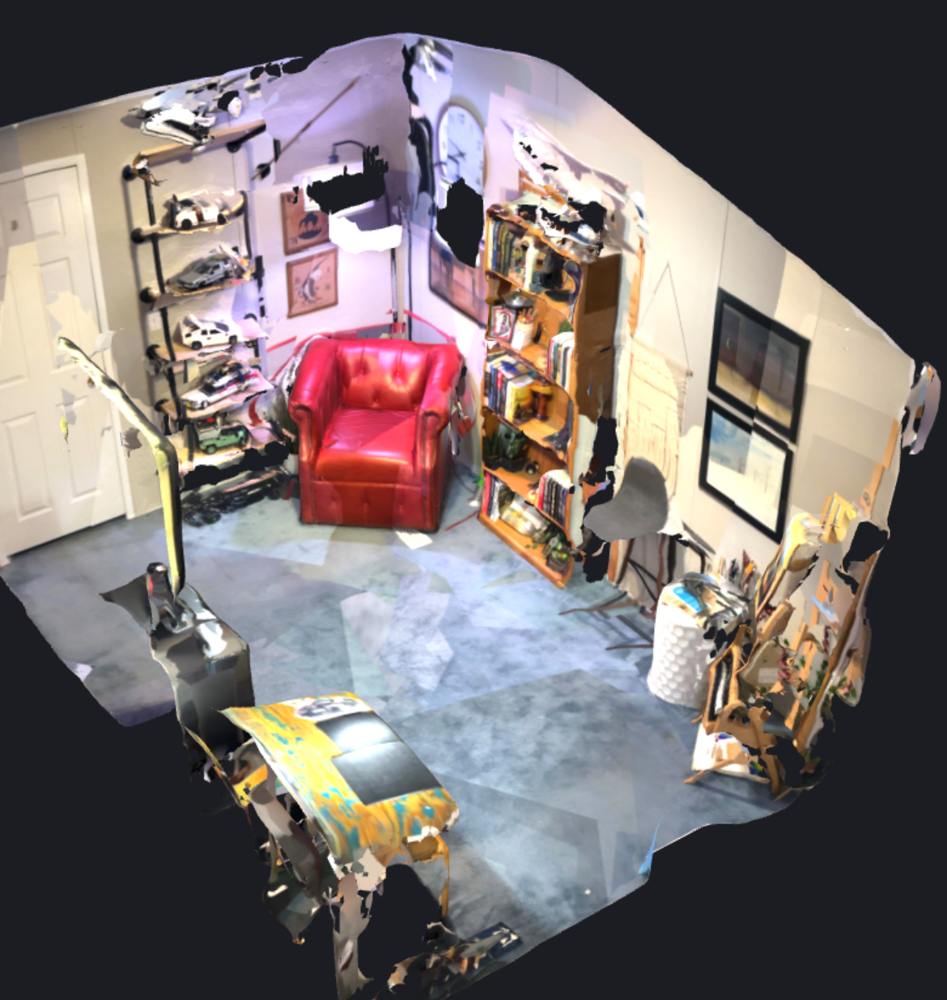
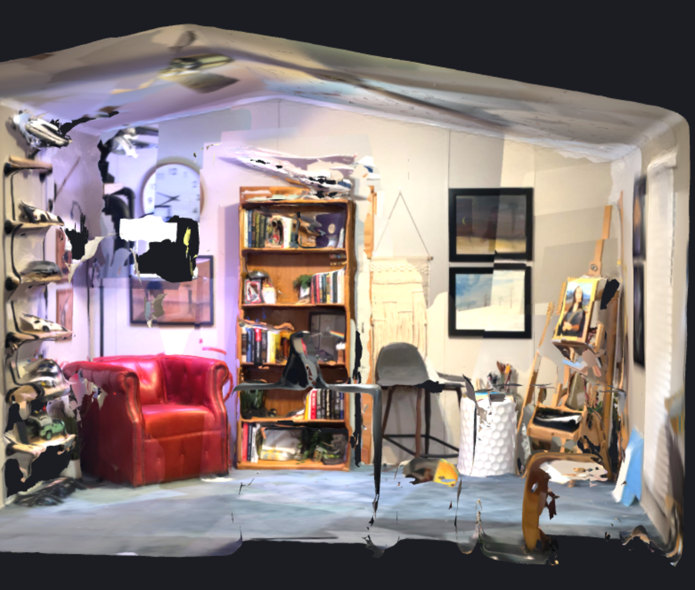

# swift-tsdf

[](https://github.com/stevyf93II/swift-tsdf/actions/workflows/ci.yml)

<p align="center">
  
  
</p>

*A real room captured with Vista on iPhone LiDAR — fused by `TSDFVolume`, surfaced by `MarchingCubes`, shown in Vista's viewer (dollhouse and cutaway).*

CPU TSDF fusion and marching cubes surface extraction in pure Swift. No
ARKit meshing, no RealityKit, no third-party dependencies -- the
reconstruction math itself, extracted from [Vista](https://github.com/stevyf93II/vista),
my iOS 3D room-scanning app, where it turns LiDAR depth frames into
watertight colored meshes.

## Why this exists

ARKit will hand you a scene mesh for free. Vista doesn't use it, because a
fused TSDF gives control over resolution, truncation, confidence gating,
and color averaging that ARKit's black-box meshing doesn't. This package
is that pipeline with the ARKit capture layer removed: hand it depth maps,
confidence maps, RGB, intrinsics, and poses from any source, get a mesh
back.

The pipeline:

```
depth + confidence + RGB + pose
        |
        v
  TSDFVolume.integrate()     weighted running average per voxel
        |
        v
  MarchingCubes.extract()    sub-voxel surface from the zero crossing
        |
        v
  PLYBinaryExporter          binary little-endian PLY, 15 bytes/vertex
```

## What's in it

**`TSDFVolume`** -- fixed-grid truncated signed distance field. Each voxel
keeps a weighted running average of signed distance, a confidence weight,
and a running-average RGB color. Overlapping observations of the same
surface average into one clean value instead of stacking into doubled
point layers; that is the entire architectural difference between fusion
and a naive accumulated point cloud.

**`IntegrateStats`** -- every `integrate()` call returns counters:
projected voxels, confidence histogram, and rejection buckets (confidence,
depth range, behind-surface). When a scan produces a thin or empty volume,
these tell you *why* -- confidence starvation looks completely different
from a depth-range mismatch. Debugging real scans without this was
guesswork.

**`MarchingCubes`** -- standard Lorensen-Cline tables, sub-voxel vertex
placement by interpolating TSDF magnitudes along crossed edges, per-vertex
color interpolation. Cubes touching any unobserved voxel (weight 0) emit
nothing, so unscanned space never grows geometry.

**`PLYBinaryExporter`** -- binary little-endian PLY for point clouds and
meshes. Binary is 3-5x smaller than ASCII PLY at zero quality cost.

## Coordinate convention

ARKit camera frame: +X right, +Y up, **-Z forward**. Pixel v grows
downward. Unprojection is `((u-cx)*d/fx, -(v-cy)*d/fy, -d)`. Every matrix
in this package assumes that convention, and the test suite's synthetic
depth renderer reproduces it exactly -- the sign conventions are where
reimplementations of this math usually die.

## What the tests caught

The suite reconstructs an analytic sphere from 16 orbiting virtual depth
cameras and measures radial error against ground truth (mean under one
voxel, max under 2.5). Writing it paid off immediately: the weight-cap
test found that the integrator divided the running average by the
*capped* weight sum. Past the cap, every additional observation inflated
tsdf by `t*w/maxWeight` per frame instead of converging -- after 80
identical frames, surface voxels sat at tsdf 2.5 in a field that is
defined on [-1, 1]. In a live scan that is surface drift whenever the
camera dwells. One-line fix (divide by the uncapped sum, then cap the
stored weight, per the standard KinectFusion update), caught by a test
before it was ever caught on a device.

## Usage

```swift
import TSDF

var config = VolumeConfig()
config.voxelSize = 0.015
config.truncation = 0.06

let volume = TSDFVolume(
    dim: 256,
    origin: SIMD3<Float>(-1.9, -1.9, -1.9),
    config: config
)

// Per frame, from your capture source:
let stats = volume.integrate(
    depth: depthPtr, confidence: confPtr,
    depthWidth: 256, depthHeight: 192,
    rgb: rgbPtr, rgbWidth: 1920, rgbHeight: 1440,
    depthIntrinsics: intrinsics,   // rescaled to depth resolution
    camToWorld: pose
)

let mesh = MarchingCubes.extract(from: volume)
try PLYBinaryExporter.writeMesh(
    positions: mesh.positions,
    colors: mesh.colors,
    triangles: mesh.triangles,
    to: outputURL
)
```

## Roadmap

- Metal compute port of the integrate kernel (the CPU loop is the
  bottleneck: 30-90 s per scan on an iPhone 12 Pro)
- Vertex welding pass on the marching cubes output
- Space carving for observed-empty regions

## License

MIT
